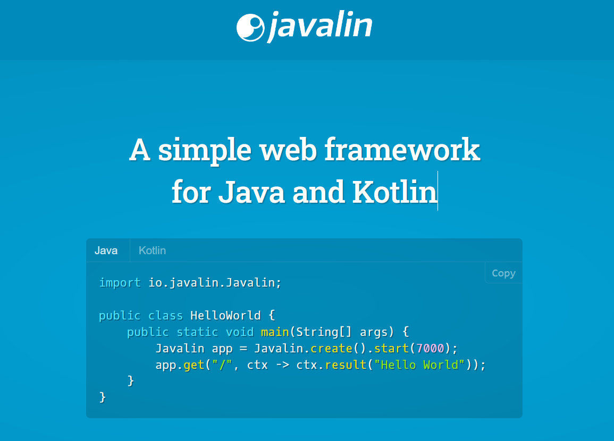

# Projeto de Trabalho Semestral de LP II
### Curso: Tecnologia em Banco de Dados
### Disciplina: Linguagem de Programação II

**Tema:** Utilização de Lightweight Frameworks para Desenvolvimento Web \

|	**Ano**		|	**Semestre**	|	**Código Disciplina**	|		   **Professor**		|
|:-------------:|:-----------------:|:-------------------------:|:-----------------------------:|
| 	  2019 		|		 3			| 			ILP102			|  Me. Lucas Gonçalves Nadalete |

### Membros do Grupo

|     **Nome**	     |             **Github**             |
|:-----------------:|:----------------------------------:|
|  Henrique Castro  |                N/A                 |
| Kleber Nascimento |  https://github.com/kleberrogerio  |
|  Maria Oliveira   | https://github.com/oliveiramclaraa |
|   Matheus Luiz    |                N/A                 |
|   Otavio Raposo   |  https://github.com/otavio-raposo  |
|   Robson Sousa    |  https://github.com/robsoncartes   |

### Requisitos

[Enunciado do Problema 1: Zerinho ou Um](https://github.com/robsoncartes/projeto-javalin/blob/master/requisitos/a-zerinho-o-um/a-zerinho-ou-um.pdf) \
[Enunciado do Problema 2: Mergulho](https://github.com/robsoncartes/projeto-javalin/blob/master/requisitos/b-mergulho/b-mergulho.pdf) \
[Enunciado Final do Trabalho](https://github.com/robsoncartes/projeto-javalin/blob/master/requisitos/trabalho-final.pdf) \
[Apresentação dos Slides](https://github.com/robsoncartes/projeto-javalin/blob/master/apresentacao/JAVALIN-LP2.pdf) \
[Comandos GIT](https://github.com/robsoncartes/projeto-javalin/blob/master/material-apoio/GIT-COMMANDS.md)

### Links Uteis

https://medium.com/danieldiasjava/criando-uma-aplica%C3%A7%C3%A3o-rest-com-javalin-b59f5c19999f

